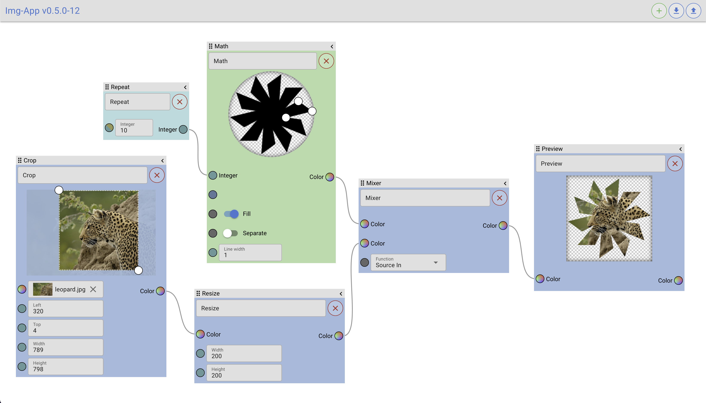

# Quasar App (img-app)

Image Editor with connectable Components

Demo [img-app](https://cubmic.ch/img-app).



## Install the dependencies
```bash
npm install
```
### Start the app in development mode (hot-code reloading, error reporting, etc.)
```bash
quasar dev
```
### Lint the files
```bash
npm run lint
```
### Build the app for production
```bash
quasar build
```
### Customize the configuration
See [Configuring quasar.conf.js](https://v2.quasar.dev/quasar-cli/quasar-conf-js).
